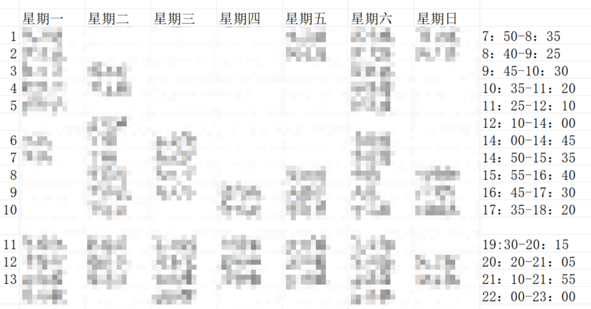
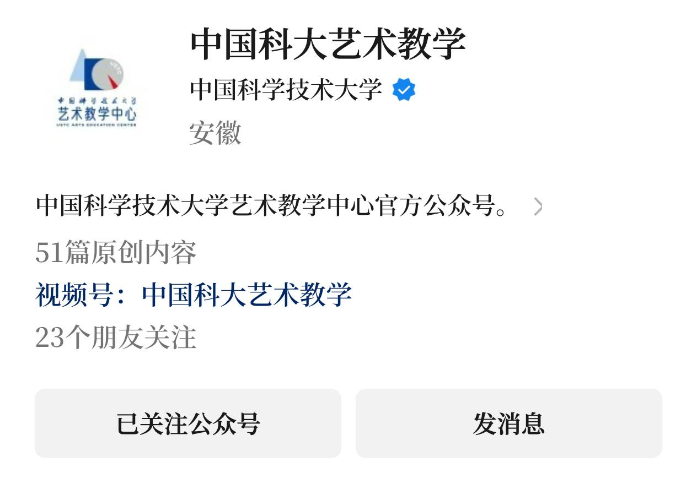
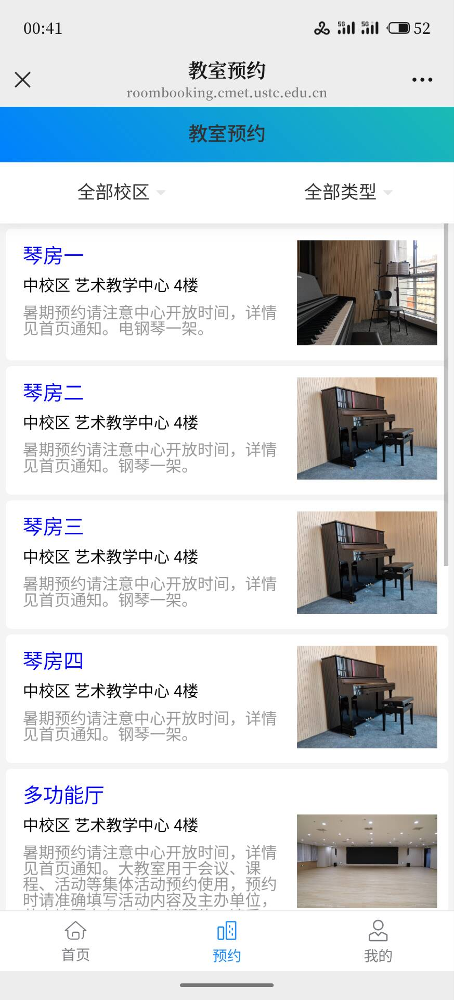

新生必读
####################

如何到达社团活动室？
------------------------

**注意：东活七楼的主要区域周一不开门，节假日正常开门！各位不要跑空了.**

管弦乐团的活动室位于东区学生活动中心（东活）708. 

首先到达东活大楼. 

东区学生活动中心的全名是 "中国科学技术大学 / 东校区 / 活动中心". 注意，"东活"是一栋大的建筑物，它的一楼中间是大厅，一楼大厅右侧是银行和办事处，二楼是美食广场（美广）. 

**二楼餐厅虽然有电梯门，但是电梯不在此停靠，需要下到一楼大厅上楼.**

东活所有电梯按二楼的按钮电梯才会关门，而关门键毫无作用. 

然后，根据下方这张地图的指引，就可以来到我们的活动室. 活动室内一般会有现在团内的成员，可以向他们询问相关事宜. 

可以在 708 的架子或者 710 存放自己的乐器. 

更多内容可以访问 `社团活动室简介 <intro.html#id1>`_ ，或下载并查看：
:download:`校学生管弦乐团活动室简介 <./_static/pdf/校学生管弦乐团活动室简介.pdf>` 

钢琴在管弦乐团的任务
------------------------
本文包含以下内容：
1. 校园内钢琴如何分部？
2. 钢琴在管弦乐团内能干什么？

省流：钢琴的很多很多活动（活动室预约，节目申报，音乐沙龙等）都属于 **演奏部** ，欢迎各位钢琴同学加入！

**一、那么，我该在哪里练琴？**

管弦乐团的活动室有两架钢琴，另外，中区艺术中心也提供了钢琴（不过需要预约）. 下面分别介绍这三个地点. 

1. 东活 7 楼

如下图，七楼活动室的 711 房间内有属于管弦乐团的一架钢琴，大家平时无需预约就可以前去练习. 另外中央大厅也有一架公用钢琴可供练习，不过注意避开管弦、民乐、合唱的排练时间. 前往东活的方法可以参考 `社团活动室简介 <intro.html#id1>`_ . 

.. figure:: ../assets/east_map.jpeg
    :scale: 50 %
    :alt: 东区地图

2. 西活

西活也有一架钢琴（西活参阅活动室简介手册），不过其使用有一些规章制度，无法直接进入，需参与练琴值班或找活动室空闲时间进入. 

**进入西活 302 需要在西活二楼的保安室领取钥匙并抵押一卡通.** 离开时需要关灯关空调并归还钥匙. 

**练琴值班** 流程如下：首先，我们将西活活动室的使用时间按 **周** 划分成多个时段. 学期初时会统一征集大家在学期内的空闲时间，并将这些时段分配给相应的同学. 之后，每位同学就可在每周固定的时段内自由使用西活琴房，无论是练习钢琴还是其他乐器都可以. 下面的表给出了一个具体例子. 

不在练琴值班表上的同学能否使用呢？能！不过需要进群看是否是表的空闲时段，或者该时段的同学是否有事请假. 此时， **需在演奏部群内发消息预约活动室**. 任何时候，都可以跟练琴的同学协商共练. 不过钢琴只有一架，我们优先考虑预约同学的意愿. 

3. 一教 1102

一教 1102 教室也有公用钢琴，教室里没有人的时候可以在此练琴. 

4. 中区艺术中心

注意：中区艺术中心 **琴房一** 的钢琴是电钢琴！
中区艺术中心的钢琴需要预约使用，先关注 **“中国科大艺术教学”** 公众号，再点击下方所示按钮. 

然后如下操作：

**二、我能参加什么活动？**
对于以下任意活动有疑问的同学欢迎咨询对应的学长学姐，若找不到人在群里问一声即可，大家都十分乐意解答. 

1. 音乐会演出

音乐会上半场会有大量钢琴独奏或合奏曲目，十分欢迎各位有钢琴基础的同学参与. 

同样，如 ACG 音乐会，活力课程等场合也需要会钢琴的同学参与. 

每次音乐会演出时都会有征集表，可加入演奏部群查看. 

2. 音乐沙龙（演奏部活动）

音乐沙龙的主要活动是：演奏、聆听音乐，进行音乐交流. 其目的是为校内同学构建一个交流与分享音乐的平台. 

3. 乐团其他部门

钢琴同学大多有良好的乐理基础，可以考虑加入谱务小组，进行转调、扒谱等工作，为演出提供支持. 当然，乐团的其他部门（宣传，学术，爱乐，财务，后勤……）也都十分欢迎，有哪个部门会拒绝新人呢？

4. 打击声部

现在的打击声部中，许多成员都是弹钢琴的. 钢琴同学对节奏的把控比较好，适合加入打击声部和我们一起大排. 并且打击声部在乐团中十分重要！加入会有学长一对一培训教学. 

5. 其他声部

若对管弦乐团的编内乐器有兴趣，也十分欢迎各位同学自己学习新的乐器. 相信你们拥有足够应对大部分演出的五线谱识谱能力. 东活活动室有公共乐器可供练习，声部内的其他同学也十分乐意为你们提供帮助！

一句话： **乐团成员能干的你都能干！**