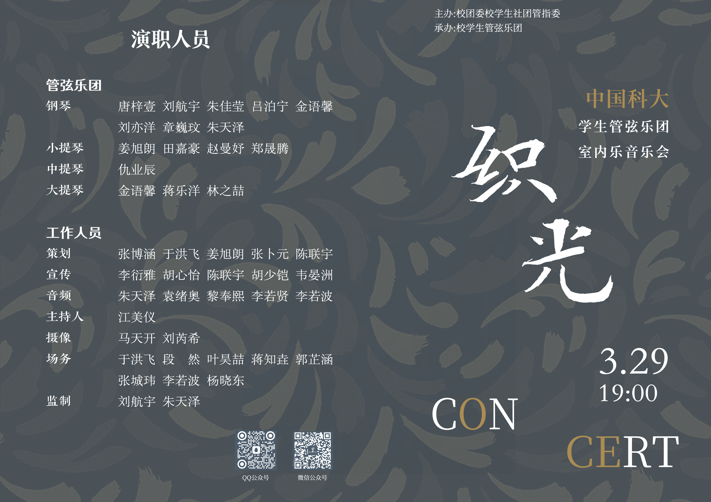
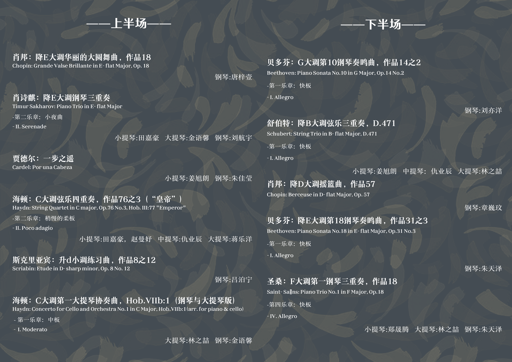

2026 年"织光"室内乐音乐会
============================

曲目
----

上半场
~~~~~~

* **肖邦**：降E大调华丽的大圆舞曲，作品18
* 钢琴：唐梓壹

* **肖诗祺**：降E大调钢琴三重奏
* 第二乐章：小夜曲
* 小提琴：田嘉豪，大提琴：金语馨，钢琴：刘航宇

* **贾德尔**：一步之遥
* 小提琴：姜旭朗，钢琴：朱佳莹

* **海顿**：C大调弦乐四重奏，作品76之3（"皇帝"）
* 第二乐章：稍慢的柔板
* 小提琴：田嘉豪 赵曼妤，中提琴：仇业辰，大提琴：蒋乐洋

* **斯克里亚宾**：升d小调练习曲，作品8之12
* 钢琴：吕泊宁

* **海顿**：C大调第一大提琴协奏曲，Hob.VIIb:1（钢琴与大提琴版）
* 第一乐章：中板
* 大提琴：林之喆，钢琴：金语馨

下半场
~~~~~~

* **贝多芬**：G大调第10钢琴奏鸣曲，作品14之2
* 第一乐章：快板
* 钢琴：刘亦洋

* **舒伯特**：降B大调弦乐三重奏，D.471
* 第一乐章：快板
* 小提琴：姜旭朗，中提琴：仇业辰，大提琴：林之喆

* **肖邦**：降D大调摇篮曲，作品57
* 钢琴：章蕴玫

* **贝多芬**：降E大调第18钢琴奏鸣曲，作品31之3
* 第一乐章：快板
* 钢琴：朱天泽

* **圣桑**：F大调第一钢琴三重奏，作品18
* 第四乐章：快板
* 小提琴：郑晟腾，大提琴：林之喆，钢琴：朱天泽
