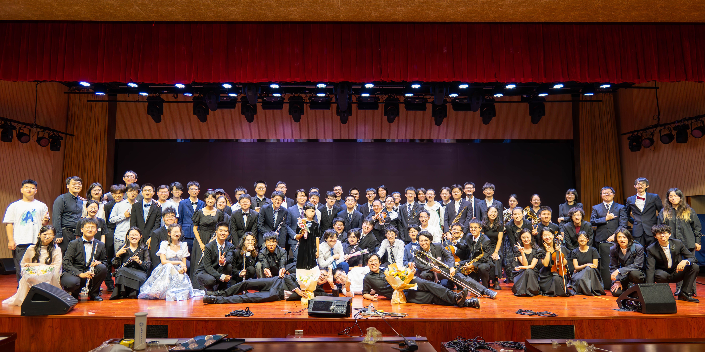
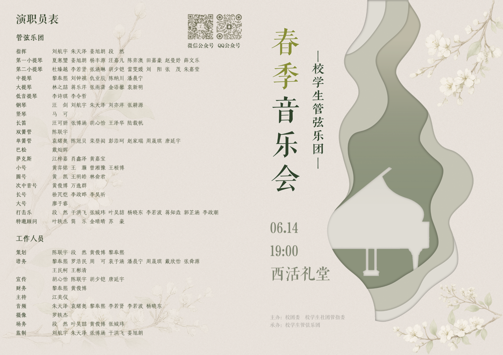
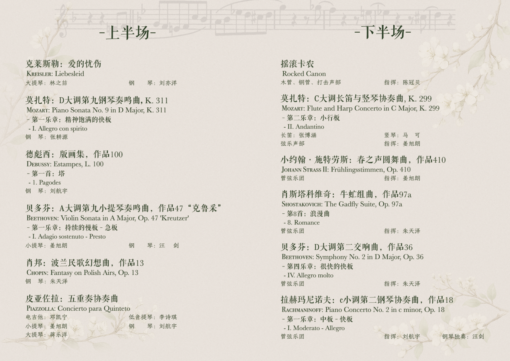

2026 年春季音乐会
==================

曲目
----

上半场
~~~~~~

* **克莱斯勒**：爱的忧伤
* **莫扎特**：D大调第九钢琴奏鸣曲，K.311（第一乐章：精神饱满的快板）
* **德彪西**：版画集，L.100（第一首：塔）
* **贝多芬**：A大调第九小提琴奏鸣曲，作品47“克鲁采”（第一乐章：持续的慢板—急板）
* **肖邦**：波兰民歌幻想曲，作品13
* **皮亚佐拉**：五重奏协奏曲

下半场
~~~~~~

* 摇滚卡农
* **莫扎特**：C大调长笛与竖琴协奏曲，K.299（第二乐章：小行板）
* **小约翰·施特劳斯**：春之声圆舞曲，作品410
* **肖斯塔科维奇**：牛虻组曲，作品97a（第八首：浪漫曲）
* **贝多芬**：D大调第二交响曲，作品36（第四乐章：很快的快板）
* **拉赫玛尼诺夫**：c小调第二钢琴协奏曲，作品18（第一乐章：中板—快板）
