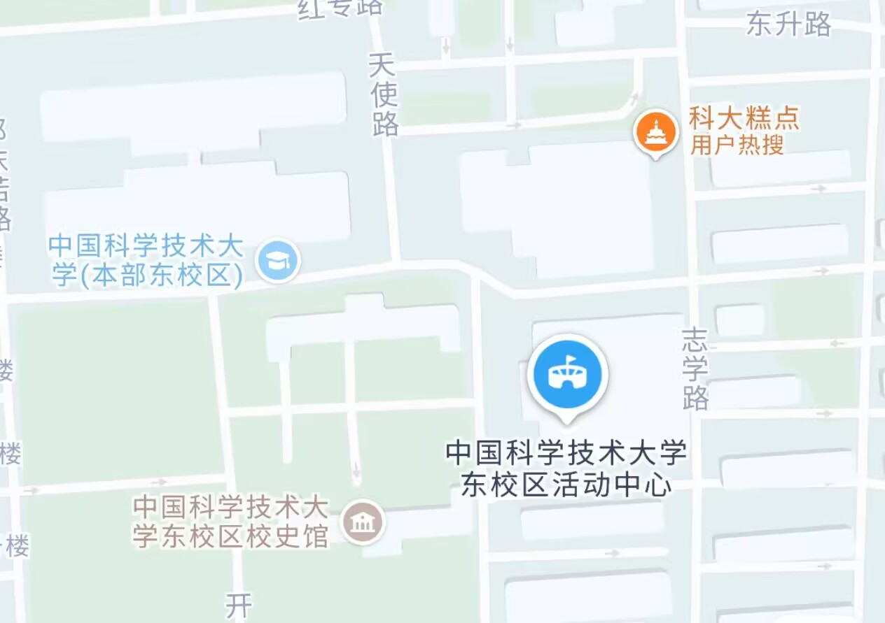
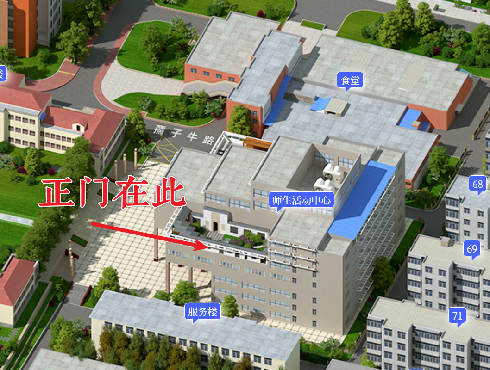
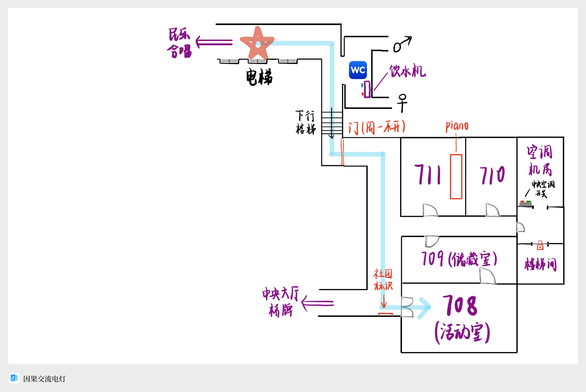
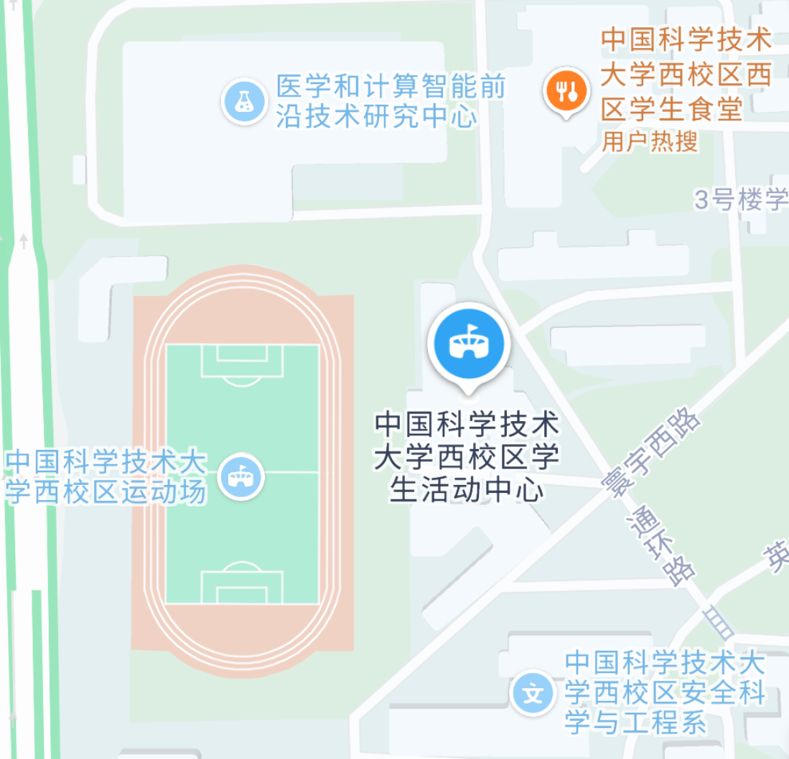
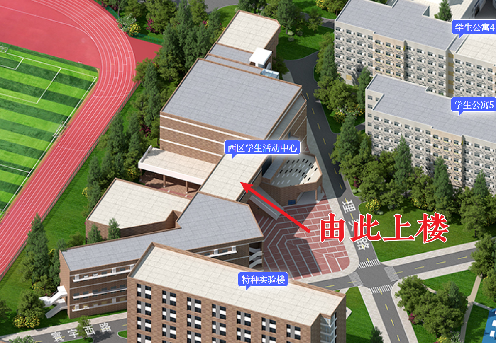
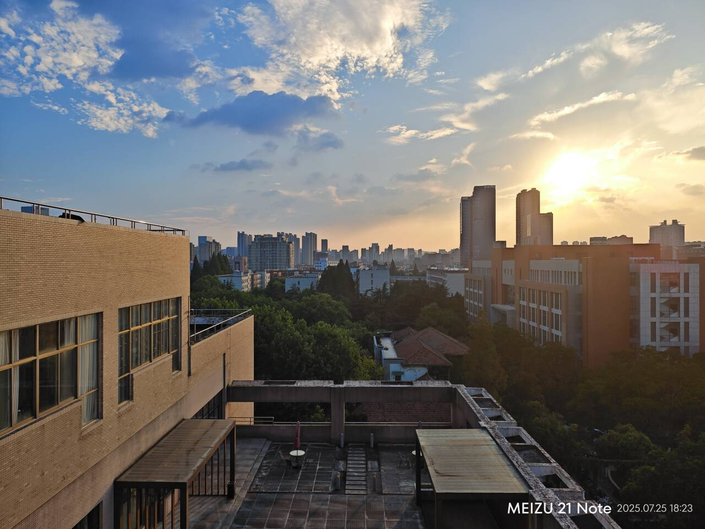
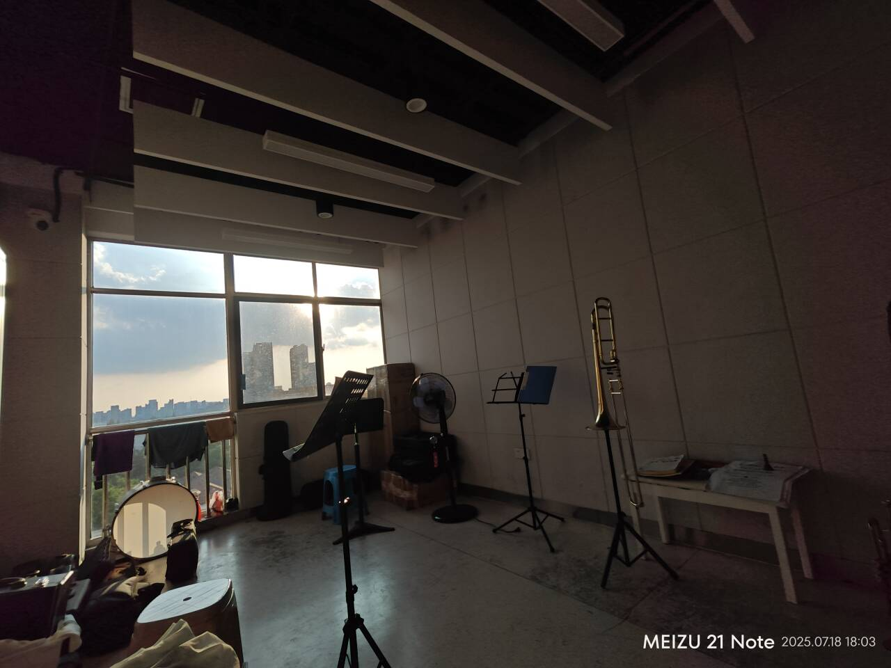

社团简介
#########################

校学生管弦乐团立足于西洋乐器（包括但不限于管弦与打击乐器、钢琴、萨克斯、古典吉他、手风琴等）的演奏以及音乐文化的研究与推广，旨在为众多乐器演奏者及音乐爱好者提供欣赏、学习、演奏、分享的平台. 乐团鼓励成员进行音乐演奏实践，定期组织周常排练、音乐沙龙等演奏交流活动. 乐团每学期均举办专场音乐会，曲目风格多样，多次协办校内大型演出，为丰富校园文化生活做出了重要的贡献.

------------

社团活动室简介
*************************

校学生管弦乐团一共有两个活动室，分别是东区学生活动中心（美食广场那栋楼）七楼 708 以及西区学生活动中心（西区操场旁边）三楼 302. 它们都是乐团成员们日常活动和排练的地方. 关于这两个活动室的详细介绍，可见下文. 
推荐网址：`USTC 地图 <https://map.ustc.edu.cn/>`_ .

东活七楼
#######################

 **注意：东活七楼的主要区域周一不开门，节假日正常开门！各位不要跑空了. ** 

下方图片展示了东区学生活动中心的全名以及地理位置. 注意，“东活”是一栋大的建筑物，它的一楼中间是大厅，只有此处的电梯可以通往七楼，一楼左侧是银行和办事处. 二楼是 **美食广场（美广）** ，所以说“美广”和“东活”其实是同一栋楼. 二楼餐厅虽然有电梯门，但是电梯不在此停靠，不要试图从这上楼. 

顺带一提，东活所有电梯的关门按键都毫无效果，而按二楼的按钮电梯才会关门，经常可以看到不明真相的新生或者老生被电梯折磨（

然后，乘坐电梯来到七楼，你就来到了东活七楼！不过七楼不仅仅是我们的活动室，也是 **民族乐团**， **合唱团**， **桥牌协会** 等社团的活动室，因此你还要根据这张地图的指引，来到我们的活动室（新人建议先去 708 来找现在团内的成员）. 

现在来介绍一下各个活动室的功能：

- **708**：主要的活动室，里面有很多桌子和柜子，经常会有人待在此处，主要是排练前后人员聚集的场所. 其中显眼的位置有一些乐器架，存放了不少弦乐、木管、铜管乐器，新生可以先把乐器存放在此处，活动室有监控，十分安全. 
- 
- **709**：和 708 相邻的房间，存放一些打击乐器、一些年久失修的乐器、一些古老的书籍和杂物. 709 内也有书桌可供休息 / 自习. 

接下来介绍的两间排练室，充当了乐团成员们日常声部小排和个人练习的空间. 新人们可以来这里自己练习乐器. 如果遇到有别的同学也在此处练习，可以商量一下能否共同练. 若不太方便，也可以拿椅子到其他无人处练习. 

- **710**：是走廊更靠内部的那间. 这间排练室里存放着不少公用铜管乐器和谱架、椅子，乐手们也可以选择把乐器放在这个房间. 柜子里可以放乐谱、键油、号嘴等杂物. 

- **711**：是走廊更靠外侧的那间. 这个房间有一架钢琴，无需预约便可以练习. 当然里面也有谱架和椅子，可以练习管弦乐. 还有神秘龙猫和神秘架子鼓. 

以上四个房间就是管弦乐团在东活主要的活动室. 

西活 302
#######################

下方图片展示了西区学生活动中心的全名以及地理位置. 注意，“西活” **也** 是一栋大的建筑物，它的一楼是乒乓球馆，顺着楼梯上二楼是西活大礼堂和保安室；顺着礼堂旁边的台阶再往上走才是西活三楼. 我们的活动室 302 是右拐右手边第一间活动室，非常好找. 里面有一架钢琴，不过其使用有一些规章制度，无法直接进入，其具体的使用细节可以加 **管弦乐团演奏部** 群. 

结语
#######################

希望这份指引能够帮助大家快速了解活动室的详情，或者是成功的第一次抵达了我们的活动室；也希望大家将来能够加入管弦乐团这个大家庭，并且度过一个充实且愉快的大学生活！

附录 ：几张活动室的照片
#######################

